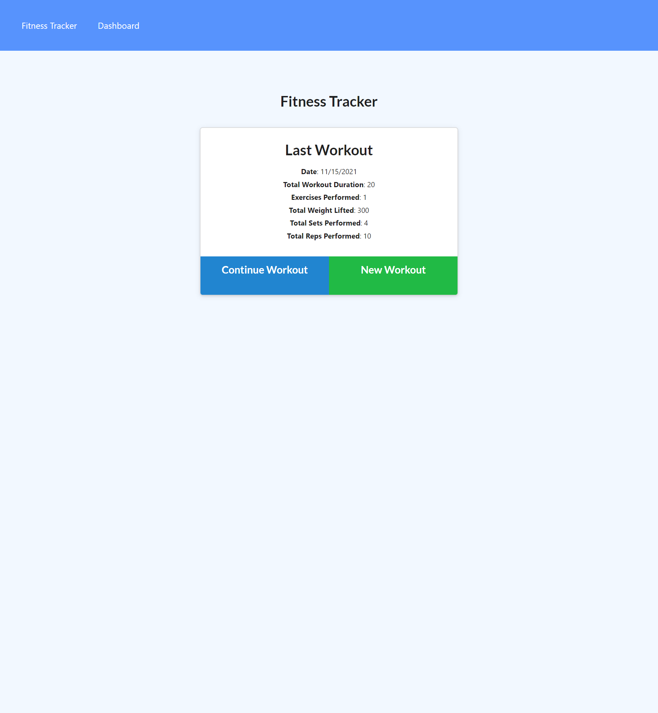

# Fitness Tracker

 ## Description
  This is a fitness tracker that will let you create workouts and exercises to help you keep track of your goals

 ## Table of Contents
  - [Insallation](#installation)
  - [Usage](#usage)
  - [Credits](#credits)
  - [License](#license)

 ## Installation
  You must first open the package.json in your terminal and then run npm -i. once you install the packages run npm i express to install express server. after that open the server.js file into your terminal and run node server.js and it will show you are connected to a local host. once the server is up and running go to your browser and enter http://localhost:3000/. 

 ## Usage
  This fitness tracker will let you create exercises so you can track the workouts youve done. When you go to the app it will show you the last workout you did to remind you where you left off. If you go to the dashboard you can see charts that show your progression over the last 7 days. With this information you can have a visual representation of the progress youve made.

 ## Credits
  [BradMW](https://github.com/BradMW)

 ## License
  

 ## Features
  This app features an overview page to see your last workout as well as a way to make a new workout. Once you have your workouts created you can go to the dashboard to see an up to date graph that will display your progress in a simple and easy to read fasion.

  Link to Heroku where the app is deployed: https://fitness-tracker-bo.herokuapp.com/?id=61941b06b5e0195e7084d437

